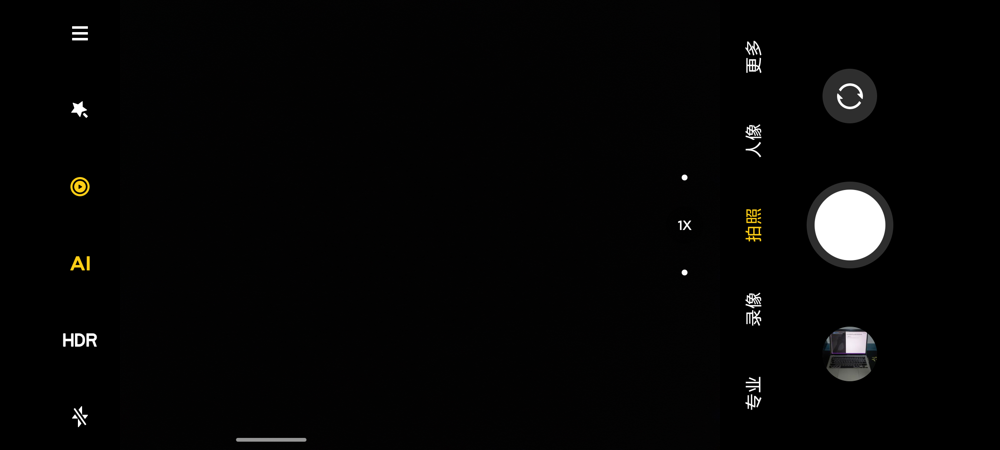
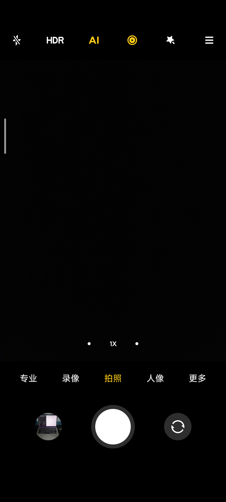
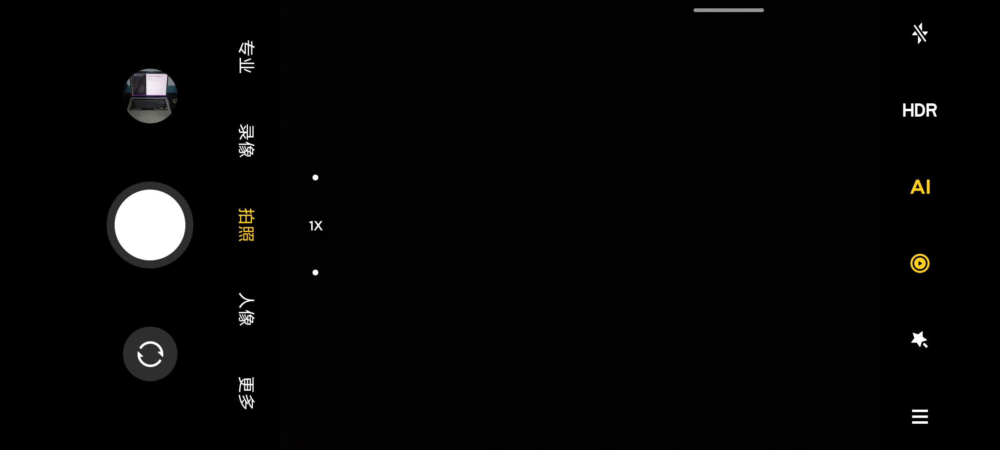
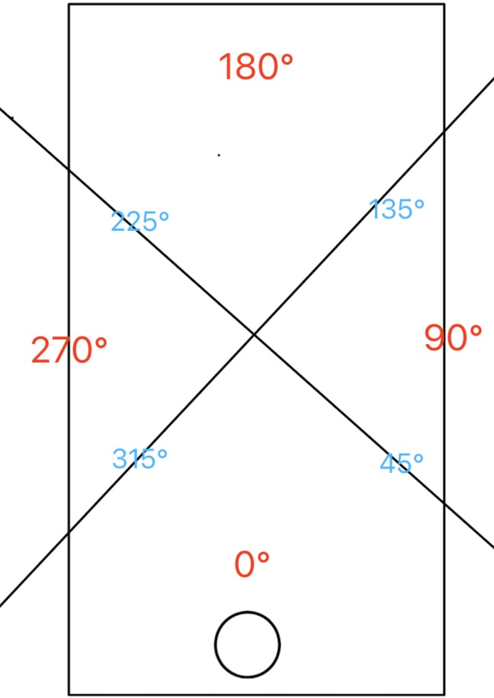
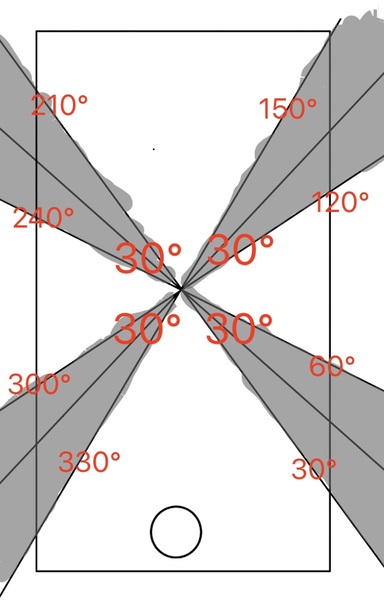

# 关于仿相机软件icon随手机旋转的研究

## 1、简单认识

我们所使用的手机原生的相机app或者是应用商店中第三方的相机应用，在使用过程中我们发现，当你在竖屏或横屏拍摄时，随着手机的旋转，相机软件界面的icon会发生相应的旋转（如图1，图2所示），这给用户带来了良好的使用体验。

<div align=center></div>
<center>图1：左横屏</center>

<div align=center></div>
<center>图2：竖屏</center>

<div align=center></div>

<center>图3：右横屏</center>

## 2、研究背景

在微影开发的移动应用软件Sight和Viewer的预览界面中，均有相同的功能，但是在阅读和编写代码的过程中发现，对应的功能代码比较零散，相关代码分布在Activity和Fragment的各个生命周期中，在增加新功能或修复缺陷的过程中，容易导致新的缺陷，可读性较差，未进行封装，在多个Fragment中均对此功能进行了完整的编写，导致代码复用率低，增加维护成本。为杜绝此现象的发生，本文将以安卓端为例，对此功能的实现展开研究，并对相关代码进行封装，从而解决代码复用率低，可读性差的问题，降低开发和维护成本，提高开发效率。下文将对实现过程展开详细介绍，并对其中细节部分进行阐述。

## 3、实现过程

安卓手机的屏幕旋转分四个方向，分别为：竖直、朝左、朝右、倒置，并且我们可以使用安卓SDK中[OrientationEventListener类](https://developer.android.google.cn/reference/kotlin/android/view/OrientationEventListener?hl=en)，当手机角度发生变化时，我们可以通过回调函数获取角度，并对界面的icon做旋转动画

那只要角度发生变化，就需要做旋转动画？？？ 不应该是在一定范围内，icon状态保持不变吗？


因此我们将按手机旋转角度分为以下四个部分：
<div align=center></div>
<center>图4：区域划分</center>

以45°、135°、225°、315°作为分界线，划分为四个区域，右横屏为45°～135°，倒置状态为135°～225°，左横屏为225°～315°，竖直状态比较特殊，分为两个小部分，分别为0°～45°和315°～360度，区域划分代码如下：

``` 
//正向竖屏（由两个范围组成）
private val portraitRange1: Range<Int> = Range(315, 360)
private val portraitRange2: Range<Int> = Range(0, 45)

//右横屏
private val rightRange: Range<Int> = Range(45, 135)

//反向竖屏
private val reservePortrait: Range<Int> = Range(135, 225)

//左横屏
private val leftRange: Range<Int> = Range(225, 315)
```

回调函数如下：

```
override
fun onOrientationChanged(orientation: Int) {
    //orientation为当前手机旋转的角度
    //Log.d(TAG, "orientation: $orientation")
}
```

当发生新的回调时，orientation会与上一次的状态做比较：

```
private fun isSameAsLast(orientation: Int): Boolean {
    return when (orientation) {
        in portraitRange1, in portraitRange2 -> {
            (lastOrientation in portraitRange1) || (lastOrientation in portraitRange2)
        }
        in rightRange -> {
            lastOrientation in rightRange
        }
        in reservePortrait -> {
            lastOrientation in reservePortrait
        }
        in leftRange -> {
            lastOrientation in leftRange
        }
        else -> false
    }
}
```

这里的else分支是为了处理orientation = -1 的情况，此时手机为水平状态。

lastOrientation默认为0，即默认手机为竖直状态：

```
private var lastOrientation: Int = 0
```

若当前状态与上一次相同则不做处理，若与上一次状态不同则需处理,并保存当前状态：

```
override
fun onOrientationChanged(orientation: Int) {
    //orientation为当前手机旋转的角度
    Log.d(TAG, "orientation: $orientation")
    if (isSameAsLast(orientation)) return

    /**
     * 进一步处理
     * fix me
     */
    lastOrientation = convertOrientation(orientation)
}
```

经过测试发现一个严重问题，使用此方法划分，存在边界值过于敏感的问题。例如：用户旋转手机的速度过快，或者用户在45°前后反复进行小角度的旋转，则回调函数会频繁回调，倒置界面图标频繁旋转的现象，造成不良的用户体验。为防止出现此现象，引入$\color{#ff0000}非敏感区域$的概念
<div align=center></div>

加入非敏感区域的划分代码如下：

```
//正向竖屏（由两个范围组成）
private val portraitRange1: Range<Int> = Range(315 + offset, 360)
private val portraitRange2: Range<Int> = Range(0, 45 - offset)

//右横屏
private val rightRange: Range<Int> = Range(45 + offset, 135 - offset)

//反向竖屏
private val reservePortrait: Range<Int> = Range(135 + offset, 225 - offset)

//左横屏
private val leftRange: Range<Int> = Range(225 + offset, 315 - offset)
```

这样就避免了在不该回调的时候发生回调的问题，确保每一次回调都是合理且真实需要的，下面是对应状态下的回调：

```
when (orientation) {
    in portraitRange1, in portraitRange2 -> {
        //正向竖屏
        onOrientationChangedListener?.invoke(0)
    }            
    in rightRange -> {
        //右横屏
        onOrientationChangedListener?.invoke(90)         
    }
    in reservePortrait -> {
        //反向竖屏
        onOrientationChangedListener?.invoke(180)
    }
    in leftRange -> {
        //左横屏
        onOrientationChangedListener?.invoke(270)
    }
}
```

接下来就是对View层的处理，通过回调函数得到的orientation对view进行旋转动画处理，由于界面存在多个icon，因此针对View进行函数扩展View.hikRotate(
orientation: Int),该方法内容为view旋转动画的处理，并通过遍历进行处理：

```
private fun doRotation(orientation: Int) {
     //orientation为屏幕旋转角度，并非是View需要旋转角度，需转化
     val degree = when (orientation) {
        0, 180 -> orientation
        90 -> 270
        else -> 90
    }
    listOf(view0, view0, view0, view0, view0).forEach {
        it.hikRotate(degree)
    }
}
```

hikRotate方法的具体实现：

```
fun View.hikRotate(degree: Int) {
    val start = this.rotation
    val rotateAnimator = ValueAnimator.ofFloat(start, degree.toFloat()).apply {
        duration = 300
        interpolator = AccelerateDecelerateInterpolator()
        addUpdateListener {
            val value = it.animatedValue as Float
            this@hikRotate.rotation = value
        }
    }
    rotateAnimator.start()
}
```

但是我们发现view旋转的方向好像出了一下问题，比如：当手机从竖屏转向左横屏的时候，view的动画应该是逆时针旋转90°，但是实际情况是从0°旋转到270°，顺时针旋转了270°，因此我们需要对view的旋转方向作相应的控制。其实view的旋转方向是由起始角度和目标角度决定，例如：从0°旋转到270°和从0°旋转到-90°，这两种情况过程上是不一样的，但是其开始和结束的状态是一样的，因此我们需要针对起始角度或目标角度做处理。以针对目标角度为例，代码如下：

```
fun View.hikRotate(degree: Int) {
    val start = this.rotation
    val end = if (start == 0f && degree.toFloat() == 270f) {
        -90f
    } else if (start == 270f) {
        when (degree) {
            0 -> 360f
            90 -> 450f
            else -> degree.toFloat()
        }
    } else if (start == 180f && degree == 0) {
        360f
    } else {
        degree.toFloat()
    }
    val rotateAnimator = ValueAnimator.ofFloat(start, end).apply {
        duration = 300
        interpolator = AccelerateDecelerateInterpolator()
        addUpdateListener {
            val value = it.animatedValue as Float
            this@hikRotate.rotation = value
        }
    }
    rotateAnimator.start()
}
```

至此，模仿相机软件界面icon随手机的旋转而旋转的功能大致就是这些，希望以后大家在做类似功能的时候，不需要再去单独编写一遍完整的代码了，尽量能够直接调用，提高代码复用率，降低开发维护成本。

## 4、针对Sight和Viewer的扩展

Sight和Viewer需要满足上述需求的同时，在开启屏幕自动旋转的情况下，需要控制UI不横屏展示，而且在屏幕倒置时，UI应相对于屏幕倒（相对于用户竖直）

判断是否开启屏幕旋转：

```
val rotationEnabled = System.getInt(contentResolver, System.ACCELEROMETER_ROTATION) == 1
```

针对此需求，需要做额外处理，但是在思考、编码、测试过程中我们发现，从$\color{#ff0000}竖屏转向右横屏$和从$\color{#ff0000}倒置转向右横屏$的过程中，其icon的角度始末变化，均为从0°转向270°，但是其变表现应该是不一样的：

从$\color{#ff0000}竖屏转向右横屏$icon需要$\color{#ff0000}逆时针$旋转90°

从$\color{#ff0000}倒置转向右横屏$icon需要$\color{#ff0000}顺时针$旋转90°

因此具体的逻辑实现需要依赖上一次的状态，则需要修改回调函数：

```
when (orientation) {
    in portraitRange1, in portraitRange2 -> {
        //正向竖屏
        Log.d(TAG, "onOrientationChanged: $des 转向 正向竖屏")
        onOrientationChangedListener?.invoke(lastOrientation, 0)
    }
    in rightRange -> {
        //右横屏
        Log.d(TAG, "onOrientationChanged: $des 转向 右横屏")
        onOrientationChangedListener?.invoke(lastOrientation, 90)
    }
    in reservePortrait -> {
        //反向竖屏
        Log.d(TAG, "onOrientationChanged: $des 转向 反向竖屏")
        onOrientationChangedListener?.invoke(lastOrientation, 180)
    }
    in leftRange -> {
        //左横屏
        Log.d(TAG, "onOrientationChanged: $des 转向 左横屏")
        onOrientationChangedListener?.invoke(lastOrientation, 270)
    }
}
```

根据回调函数中上一次状态和当前状态做判断：

```
HikOrientationListener(this) { last, current ->
    when (current) {
        0 -> {
            if (requestedOrientation == ActivityInfo.SCREEN_ORIENTATION_REVERSE_PORTRAIT) {
                requestedOrientation = ActivityInfo.SCREEN_ORIENTATION_PORTRAIT
            }
            doRotation(current)
        }

        90 -> {
            when (last) {
                0 -> doRotation(current)
                180 -> doRotation(-current)
                else -> if (requestedOrientation == ActivityInfo.SCREEN_ORIENTATION_PORTRAIT) {
                    doRotation(90)
                } else {
                    doRotation(-current)
                }
            }
        }
        180 -> {
            if (requestedOrientation == ActivityInfo.SCREEN_ORIENTATION_PORTRAIT) {
                requestedOrientation = ActivityInfo.SCREEN_ORIENTATION_REVERSE_PORTRAIT
            }
            doRotation(0)
        }
        270 -> {
            when (last) {
                0 -> doRotation(current)
                180 -> doRotation(90)
                else -> if (requestedOrientation == ActivityInfo.SCREEN_ORIENTATION_PORTRAIT) {
                    doRotation(-current)
                } else {
                    doRotation(90)
                }
            }
        }
    }
}
```

至此仿相机软件icon旋转问题的研究结束。

## 5、附件

1、[demo源码](./res/HikOrientationListener.zip)